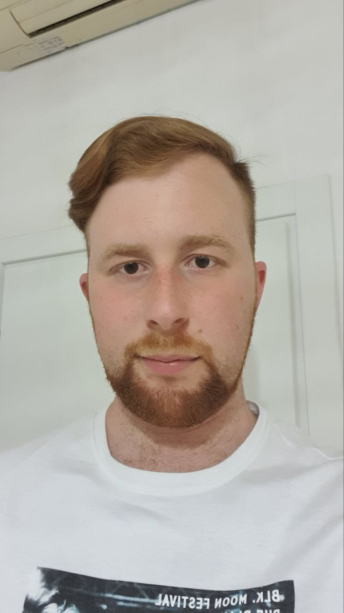
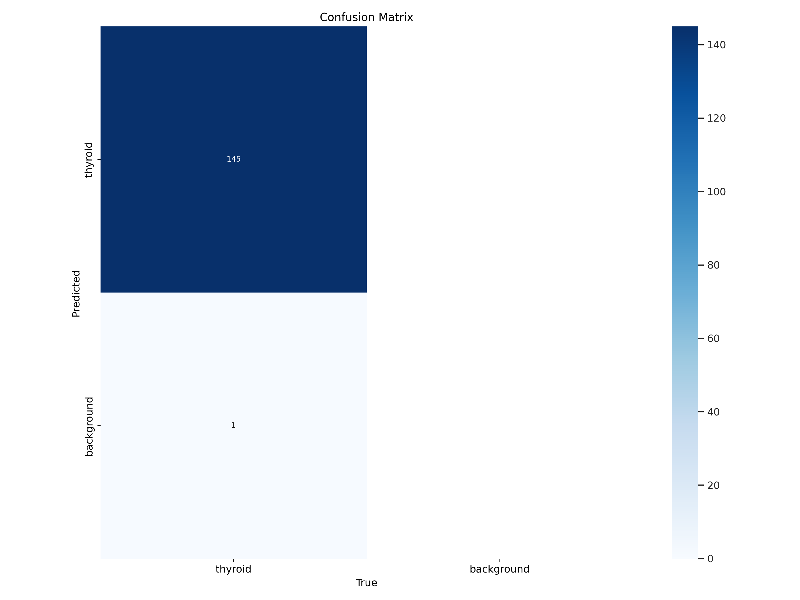

# OrganDetect: AI Based Tyroid Organ Detection on Grayscale Echographs
Gruppo numero 1: Morgan

MC 2024/2025


||||
-|-|-|-|-

Giuseppe Spathis, Matteo Fontana, Federico Augelli, Emanuele di Sante, Alessandro Mencarelli

(anno 1, curriculum C), (anno 1, curriculum A), (anno 2, curriculum A) (anno 1, cirriculum A) (anno 1, curriculum A)
## 1. Introduzione
### 1.1 Obiettivo del progetto
Il progetto OrganDetect mira all'automatizzazione del riconoscimento della tiroide su immagini ecografiche mediante l'uso di tecnologie basate su Intelligenza Artificiale, Computer Vision, e il software Mathematica [1].


Il progetto volge al supporto del personale medico specializzato, che tradizionalmente definisce manualmente su un'ecografia dove e' presente la tiroide. L'obbiettivo e' dunque quello di aumentare l'efficienza diagnostica e l'annotazione delle aree d'interesse, ricordando l'importanza di sviluppare questo strumento insieme alla possibilita' da parte degli esperti di apportare modifiche all'area trovata qualora fosse necessario.

### 1.2 Definizione del problema
OrganDetect è un task di localizzazione e riconoscimento di organi in immagini, contestualizzato per la ricerca in ambito medico. 
In particolare, si tratta di individuare una specifica area all’interno di immagini ecografiche in scala di grigi; per avere risultati ottimali il modello dovrebbe essere robusto al rumore, scarsa risoluzione, artefatti e variabilità individuale.

La localizzazione di organi in un'ecografia rimane oggi un problema ancora da affrontare in particolare quando si tratta di definire tali organi a partire da una singola ecografia: Lo studio "Optimization of Thyroid Volume Determination by Stitched 3D-Ultrasound Data Sets in Patients with Structural Thyroid Disease" [2] fa uso di dati piu' completi per permettere agli strumenti utilizzati di individuare correttamente ed accuratamente la volumetria della tiroide, mentre nel nostro caso, ci limitiamo ai casi dove in input ci troviamo solamente una singola ecografia sottoforma di immagine bidimensionale.

La sfida consiste quindi nel progettare un sistema che sia soprattutto robusto, affidabile ed interpretabile, lasciando al contempo il potere decisionale del risultato in output all'utente finale.

## 2. Tutorial sull'utilizzo
### 2.1 Installazione ed avvio
Saranno presenti due sezioni per il funzionamento
#### 2.1.1 Linux/Darwin
Esegui lo script `run.sh` per installare l'ambiente ed eseguire l'applicativo.

#### 2.1.2 Windows

E' richiesta l'installazione di [miniconda](https://www.anaconda.com/docs/getting-started/miniconda/install#quickstart-install-instructions) (e conseguentemente [Python](https://www.python.org/downloads/windows/)) per il funzionameno del progetto.

Nell'ambiente base di miniconda, nella cartella principale del progetto, eseguire il seguente comando da terminale:

```bash
conda env create -f environment.yml
```

Infine, avviare l'applicazione aprendo in WOLFRAM MATHEMATICA 14.2.0.0 il file `tutorial.nb`.

### 2.2 Utilizzo
All'avvio dell'applicazione, Wolfram chiedera' l'evaluation automatica delle celle di inizializzazione. Cliccare "Si"/"Yes".


L'UI dell'applicazione apparira' dopo poco.


A questo punto fare click sul pulsante "Browse..." per selezionare l'immagine di un'ecografia di tiroide su cui eseguire l'organ detection. E' richiesto un formato in `.png`, `.jpg` o `.jpeg`.


Cliccare sul pulsante "Esegui Organ Detection" per avviare il processo di riconoscimento della tiroide. Una schermata di caricamento segnalera' l'inizio della valutazione dell'immagine.


L'output dell'immagine verra' salvata nella cartella del progetto, e mostrata nell'interfaccia. e' possibile modificare l'area individuata tramite il tasto "Modifica maschera".


Le opzioni di modifica incluse nel programma sono:
- Modifica punti
- Aggiungi punti
- Rimuovi punti


Inoltre viene data la possibilita' di salvare l'immagine con l'area trovata nell'ecografia con il tasto "Salva immagine" nella parte inferiore dello schermo. L'immagine verra' salvata nella cartella dell'applicativo.


## 3. Approccio alla risoluzione del problema
La strada che abbiamo scelto di percorrere per arrivare all'obiettivo e' stata quella di migliorare un modello preesistente di computer vision, YOLOv8 [3], e sottoporlo ad una fase di fine tuning con un piccolo dataset di ecografie con le relative ground truth per addestrarlo a riconoscere correttamente le aree di tiroide presenti nelle ecografie che verranno caricate nell'applicativo pianificato per l'utilizzo dall'utente finale.

### 3.1 Primo approccio: fine tuning all'interno di Mathematica
Originariamente, il progetto era studiato perche' fosse completamente realizzato in Mathematica, tuttavia abbiamo riscontrato diverse difficolta' nell'implementazione del processo di fine tuning del modello.
Nello specifico, le operazioni necessarie per il corretto funzionamento del *fine-tune* richiedevano un riadattamento dell'ultimo layer modello **YOLO-V8**, affinchè fosse *compliant* alle esigenze del progetto. E quindi stata definita la classe di predizione <span style="color:red">tiroide</span> al posto delle classiche 80 classi di *YOLO*.
Il dataset era così creato:
Il modello è stato definito tramite la funzione *built-in* `NetModel`:
```mathematica
baseModel = NetModel["YOLO V8 Segment Trained on MS-COCO Data", "UninitializedEvaluationNet"];
```
Successivamente è stato eseguito il preprocessing delle immagini. Ogni istanza del dataset era nella forma:
```mathematica
<|
    "Input" -> img,
    "Target" -> <|
      "Boxes" -> {{xmin, ymin, xmax, ymax}},
      "Classes" -> {classIndex},
      "Masks" -> {binaryMask}
    |>
|>
```
Dove `Input` sono le immagini fornite in input, `Target` l'output del modello.

Infine sono stati definiti i parametri per il *fine-tune* del modello:
```mathematica
trainingOptions = {
    BatchSize -> 4,
    MaxTrainingRounds -> 50,
    LearningRate -> 0.0001,
    TargetDevice -> "CPU",    (* Use "GPU" if available *)
    RandomSeeding -> 42
  };
```
Ed è stato definto il processo di *fine-tuning*:
```mathematica
  fineTunedNet = Check[
    NetTrain[
      baseModel,
      trainingData,
      All,
      ValidationSet -> validationData,
      Sequence @@ trainingOptions
    ],
    $Failed
  ];
```
Ogni prova e modifica del codice da questo punto in poi è stata segnata dalla comparsa di questo errore:
`Part 4 of NeuralNetworksNetPath[Inputs,Input1] does not exist, An unknown internal error occurred`
Seguito da un errore interno più spefico:
```
Last internal error: Unreachable
Function MXNetLinkNDArraySetConstant encountered an unreachable expression. The LHS was MXNetLinkNDArraySetConstant[Missing[KeyAbsent,.Nodes.Net.Nodes.Detect.Nodes.proto.Nodes.Bn_1.Arrays.Biases],0.].
```

Il primo errore suggerisce che `NetTrain` non riesce a capire la struttura interna del modello (o dell'input fornito al modello) e fallisce nell'esecuzione.
Il secondo errore è molto più specifico e conferma che alcuni parametri nei metadata forniti a `NetTrain` sono mancanti (o forse non inizializzati). L'import del modello è quindi stato cambiato eliminando la definizione `UninitializedEvaluationNet`. Anche queste modifiche non hanno sortito alcun cambiamento nella natura degli errori restituiti dal *Fine-Tuning*.

Successivamente si è provato a inizializzare manualmente la rete tramite la *built-in* `NetInitialize[baseModel];`, aluni parametri normalmente riconosciuti automaticamente da *YOLO* sono stati definiti in maniera *Hard Coded* come la **Loss Function**.
Il persistere degli errori ha messo in luce come i parametri da definire manualmente fossero molti di più (non solo input e output) e che determinarli manualmente necessitava di una conoscenza approfondita del modello *YOLO*.
Le ragioni di questo mancato funzionamento del modello possono essere molteplici tra i quali:
1. Incompatibilità della versione di *Mathematica* utilizzata con il modello *Yolo*
2. Impossibilità di eseguire il *fine tuning* direttamente all'interno di *Mathematica*
3. Errore interno alla rete dovuto alla mancata definizione manuale di qualche parametro

La documentazione online riguardo quest'argomento è deficitante e limitata soltanto all'inferenza del modello anziché il fine-tuning. La mancanza di informazioni unita alla scarsa verbosità degli output forniti da *Mathematica* ha suggerito un approccio diverso.

### 3.2 Secondo approccio: preprocessing e fine tuning con python
A seguirsi della rivisitazione, il preprocessing delle immagini e il fine tuning di YOLOv8 e' stato effettuato tramite python, mentre l'UI e le funzionalita' esterne all'interazione con i pesi e con il modello di computer vision sono state realizzate in mathematica.

## 4. Architettura del progetto e funzioni
### 4.1 Descrizione dei file principali

#### Moduli di Mathematica
- **dcm2jpg.m**
  - Contiene la funzione utility per la conversione del dataset originale da `DICOMT` in formato `JPEG`, parte del preprocessing dei dati per l'addestramento.
  -  `ConvertDICOMToJPEGs` esegue la conversione del file su un numero specifico di slice selezionati.

- **OrganDetection.m**
  - Contiene le funzioni di collegamento tra Mathematica e Python per la detection degli organi.   
  - `OrganDetection`: esegue la detection di organi su un'immagine fornita interfacciandosi con `inference.py`, restituendo i risultati in formato utilizzabile dall'interfaccia Mathematica.

- **OrganDetectionUI.m**
  - Gestisce la logica dell’interfaccia utente grafica in Mathematica.
  - `LaunchOrganDetectionUI`: avvia l’interfaccia grafica per il caricamento immagini, esecuzione detection e modifica delle maschere.

L'interfaccia utente gestisce la logica per la modifica dell'immagine in output dall'inferenza, riportata di seguito in pseudocodice

```mathematica
Initialize:
  points ← detected polygon points from OrganDetection
  mode ← "edit" | "add" | "remove" (default: "edit")
  selectedPointIndex ← None
  clickThreshold ← 10.0 (pixel distance for point selection)

OnMouseDown(mousePosition):
  If mousePosition is None: return

  Switch mode:
    Case "edit":
      For each point in points:
        If EuclideanDistance(mousePosition, point) < clickThreshold:
          selectedPointIndex ← index of the point
          Exit loop

    Case "add":
      If points has at least 2 vertices:
        For each segment between points:
          Compute perpendicular distance from mousePosition to segment
        Insert new point into points at position of nearest segment

    Case "remove":
      If points has more than 3 vertices:
        Find nearest point to mousePosition
        If EuclideanDistance < clickThreshold:
          Remove that point from points

OnMouseDragged(mousePosition):
  If selectedPointIndex is valid:
    Move selected point to mousePosition

OnMouseUp:
  selectedPointIndex ← None

```

#### Notebook di Mathematica

- **tutorial.nb**
  - Notebook principale per l’utente: fornisce una guida interattiva all’uso del sistema, carica i package necessari e lancia l’interfaccia utente per la detection.

#### Python ed altre risorse

- **inference.py**
  - Script Python che esegue l’inferenza del modello YOLOv8 sull'immagine fornita. Viene richiamato da Mathematica tramite le funzioni di collegamento per effettuare la detection vera e propria, utilizzando i pesi in output del fine tuning in `best.pt`.
  - Contiene la funzionalita' di mappatura del risultato dell'inferenza in coordinate che l'UI sviluppata come parte del pacchetto interpretera' per creare l'apposita' maschera editabile.

- **run.sh**
  - Script bash per l’installazione automatica dell’ambiente Python e l’avvio dell’applicativo su sistemi Linux/Darwin.

- **environment.yml**
  - File di configurazione per Conda che specifica tutte le dipendenze Python necessarie per il corretto funzionamento del progetto.

- **dataset/**
  - Cartella che contiene il dataset di immagini ecografiche originali e le relative ground truth utilizzate per il training e la validazione del modello.

- **metricheTraining/** 
  - Cartella contenente i risultati dei test post fine-tuning, approfonditi piu' avanti.

- **best.pt**
  - File dei pesi del modello YOLOv8 ottimizzato tramite fine-tuning sul dataset specifico del progetto. Utilizzato per l’inferenza sulle nuove immagini richieste tramite l'ui implementata.

- **yoloSegmentation.ipynb**
  - Notebook utilizzato per effettuare il fine-tuning di YOLOv8.

### 4.2 Parametri di fine-tuning
Il dataset originale e' stato riorganizzato in formato YOLO, con immagini e relative etichette delle maschere suddivise in set di addestramento e valori (suddivisione 80/20, risultando in 704/176 immagini rispettivamente).
Le maschere vengono convertite in etichette di segmentazione YOLO in formato poligonale e coordinate normalizzate.
L'unica classe rilevante ai fini del nostro addestramento e' la tiroide.

Il modello base scelto per il fine-tuning è YOLOv8 small, variante di segmentazione con 100 epoche e 8 come dimensione batch.

```python
SET path_to_data_yaml ← '/content/yolo_thyroid_dataset/data.yaml'

SET model_name ← 'yolov8s-seg.pt'

LOAD pretrained YOLO model using model_name

SET training parameters:
    epochs ← 100
    img_size ← 640
    batch_size ← 8
    run_name ← 'thyroid_seg_finetune'

IF data.yaml exists:
    PRINT "Training started"
    CALL model.train with:
        - data ← path_to_data_yaml
        - epochs ← epochs
        - imgsz ← img_size
        - batch ← batch_size
        - name ← run_name
        - project ← 'YOLOv8_Thyroid_Runs'
    PRINT "Training completed"
ELSE:
    PRINT error: training not started

```


Dopo l'addestramento, i pesi migliori (best.pt) vengono utilizzati per la convalida sul set di test ed i risultati salvati in `metricheTraining`.

## 5. Analisi dei risultati
Il modello YOLOv8 dopo il fine-tuning ha dimostrato importanti miglioramenti nel rilevamento e segmentazione durante le diverse epoche di addestramento. Le prestazioni sono state valutate utilizzando metriche standard di rilevamento degli oggetti, tra cui precision, recall, mean precision a soglie IoU di 0,5 (mAP@0,5) e la più restrittiva mAP@0,5:0,95, insieme alle perdite di addestramento e convalida per i task di bounding box, segmentazione e classificazione.

A partire dalla prima epoca, si è registrato un calo significativo in tutte le componenti della perdita di addestramento. La perdita della bounding box è diminuita da 1,52 a 1,33, la perdita di segmentazione da 2,49 a 1,64 e la perdita di classificazione da 2,77 a 1,08 nelle prime cinque epoche. Analogamente, le perdite di convalida hanno seguito un trend decrescente costante, con la perdita della bounding box che è scesa da 3,05 a 1,44 e la perdita di segmentazione da 9,08 a 2,39. Questo modello di convergenza indica un apprendimento efficace, con un overfitting minimo, almeno per quanto riguarda il test interno del dataset.

Le prestazioni del modello sono migliorate rapidamente durante le prime epoche. La precisione nel set di metriche di base (B) è aumentata dal 3,2% a quasi l'88%, mentre il recall è passato dal 2,1% a oltre il 90%. Il valore mAP@0,5 per questo set ha raggiunto il 90,8% entro l'epoca 4, suggerendo che il modello ha localizzato accuratamente le regioni tiroidee. Anche in condizioni più rigorose (mAP@0,5:0,95), le prestazioni sono migliorate dallo 0,1% al 50% nello stesso periodo.

I risultati sul set di metriche secondarie (M), che potrebbero rappresentare una divisione di convalida separata, hanno rispecchiato questi miglioramenti. Il valore mAP@0,5 è salito al 96,4%, mentre il valore mAP@0,5:0,95 ha raggiunto il 48,4% entro l'epoca 5. Questi risultati confermano la robustezza del modello in diversi sottoinsiemi di dati.

Al termine delle epoche, durante l'inferenza finale dello split di test, possiamo vedere nella matrice di confusione (figura 7) come il modello raggiunga una precisione elevatissima nel predirre la zona di tiroide di un'ecografia, facendo combaciare le prestazioni che abbiamo osservato nei dati durante il fine-tuning.



Il modello ottimizzato YOLOv8 ha raggiunto un'elevata capacità di rilevamento e segmentazione delle regioni tiroidee nelle immagini ecografiche. Il costante miglioramento delle perdite e delle metriche di valutazione nel corso delle epoche sottolinea l'idoneità di YOLOv8 ci ha segnalato ottimi risultati che hanno superato non poco le nostre aspettative.

Un'osservazione da includere tuttavia e' la difficolta' del modello di individuare la tiroide in ecografie dove essa e' molto piccola o quasi assente, dove essa si confonde facilmente con il resto dell'immagine, ed e' difficilmente percettibile anche per noi non professionisti. Affronteremo questo argomento e le possibili soluzioni piu' avanti.

## 6. Sviluppi futuri
La ricerca condotta ha mostrato ottimi risultati nei task prestabiliti, e crediamo sia quindi un'ottima strada quella di proseguire in questa direzione,pertanto i possibili sviluppi futuri proposti dal nostro team sono un fine-tuning con un dataset di maggiori dimensioni, includendo un crescente numero ecografie di diversi pazienti per addestrare il modello ad uno spettro piu' ampio di dati che renda la rilevazione piu' robusta, un sistema avanzato di rilevazione organi esterni alla tiroide, dove sia possibile selezionare l'organo d'interesse. Questo richiedera' un importante quantita' di dati (ecografie e relative ground truth) per il training di ogni relativo d'organo.


## Bibliografia
[1] Wolfram Research, Inc., Mathematica, Version 14.2, Champaign, IL (2024). https://www.wolfram.com/mathematica
[2] Seifert P, Ullrich SL, Kühnel C, Gühne F, Drescher R, Winkens T, Freesmeyer M. Optimization of Thyroid Volume Determination by Stitched 3D-Ultrasound Data Sets in Patients with Structural Thyroid Disease. Biomedicines. 2023 Jan 27;11(2):381. doi: 10.3390/biomedicines11020381. PMID: 36830918; PMCID: PMC9952922.
[3] Jocher, G., Qiu, J., & Chaurasia, A. (2023). Ultralytics YOLO (Version 8.0.0) [Computer software]. https://github.com/ultralytics/ultralytics

## Glossario

- Foto 1: Immagine profilo di Giuseppe spathis
- Foto 2: Immagine profilo di Matteo Fontana
- Foto 3: Immagine profilo di Federico Augelli
- Foto 4: Immagine profilo di Emanuele di Sante
- Foto 5: Immagine profilo di Alessandro Mencarelli
- Figura 1: Esempio di ecografia
- Figura 2: Automatic evaluation prompt
- Figura 3: Immagine selezionata nella UI
- Figura 4: Elaborazione in corso dell'inferenza
- Figura 5: Output dell'inferenza
- Figura 6: UI di modifica
- Figura 7: Matrice di confusione
