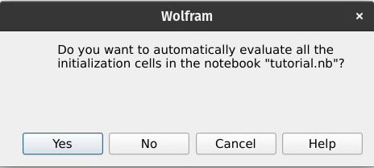

# Notes
- Introduction -> task goal, definizione del problema, finding 2d thyroids
- Tutorial -> the contents of this md file, update with run bash, UI introduction with tons of images
- Approaches -> failed finetune in mathematica, successive implementation with python
- Data processing | training -> Yolov8 x segmentazione, dataset di ecografie di 16 pazienti con relative ground truth, file division (eg. OrganDetection.m holds python-mathematica recall functions, dcm2jpg to dataset preprocessing)
- Finetune -> 100 epoche, split 704-176 80-20, su python (reference filename), usando Colab
- results -> nella cartella results in results.csv, descrivere csv (gpt aiuta), detection in 2d non e' perfetta rispetto alla 3d https://pubmed.ncbi.nlm.nih.gov/36830918/
- inferenza -> pesi = best.pt, file richiamato per predizione su una nuova foto
- evaluation -> todo
- progetti futuri -> aumentare il dataset, detection di altri organi
# OrganDetect: AI Based Organ Detection
Gruppo numero 1: Morgan

MC 2024/2025


|Foto 2|Foto 3||Foto 5
-|-|-|-|-

Giuseppe Spathis, Matteo Fontana, Federico Augelli, Emanuele di Sante, Alessandro Mencarelli

(anno 1, curriculum C), (anno 1, curriculum A), (anno 2, curriculum A) (anno 1, cirriculum A) (anno 1, curriculum A)
## 1. Introduzione
### 1.1 Obiettivo del progetto
Il progetto OrganDetect mira all'automatizzazione del riconoscimento della tiroide su immagini ecografiche mediante l'uso di tecnologie basate su Intelligenza Artificiale, Computer Vision, e il software Mathematica.


Il progetto volge al supporto del personale medico specializzato, che tradizionalmente definisce manualmente su un'ecografia dove e' presente la tiroide. L'obbiettivo e' dunque quello di aumentare l'efficienza diagnostica e l'annotazione delle aree d'interesse, ricordando l'importanza di sviluppare questo strumento insieme alla possibilita' da parte degli esperti di apportare modifiche all'area trovata qualora fosse necessario.

### 1.2 Definizione del problema
OrganDetect è un task di localizzazione e riconoscimento di organi in immagini, contestualizzato per la ricerca in ambito medico. 
In particolare, si tratta di individuare una specifica area all’interno di immagini ecografiche in scala di grigi; per avere risultati ottimali il modello dovrebbe essere robusto al rumore, scarsa risoluzione, artefatti e variabilità individuale.

La sfida consiste quindi nel progettare un sistema che sia soprattutto robusto, affidabile ed interpretabile, lasciando al contempo il potere decisionale del risultato in output all'utente finale.

## 2. Tutorial sull'utilizzo
### 2.1 Installazione ed avvio
Saranno presenti due sezioni per il funzionamento
#### 2.1.1 Linux/Darwin
Esegui lo script `run.sh` per installare l'ambiente ed eseguire l'applicativo.

#### 2.1.2 Windows

E' richiesta l'installazione di [miniconda](https://www.anaconda.com/docs/getting-started/miniconda/install#quickstart-install-instructions) (e conseguentemente [Python](https://www.python.org/downloads/windows/)) per il funzionameno del progetto.

Nell'ambiente base di miniconda, nella cartella principale del progetto, eseguire il seguente comando da terminale:

```bash
conda env create -f environment.yml
```

Infine, avviare l'applicazione aprendo in WOLFRAM MATHEMATICA 14.2.0.0 il file `tutorial.nb`.

### 2.2 Utilizzo
All'avvio dell'applicazione, Wolfram chiedera' l'evaluation automatica delle celle di inizializzazione. Cliccare "Si"/"Yes".



L'UI dell'applicazione apparira' dopo poco.


A questo punto fare click sul pulsante "Browse..." per selezionare l'immagine di un'ecografia di tiroide su cui eseguire l'organ detection. E' richiesto un formato in `.png`, `.jpg` o `.jpeg`.


Cliccare sul pulsante "Esegui Organ Detection" per avviare il processo di riconoscimento della tiroide. Una schermata di caricamento segnalera' l'inizio della valutazione dell'immagine.


L'output dell'immagine verra' salvata nella cartella del progetto, e mostrata nell'interfaccia. e' possibile modificare l'area individuata tramite il tasto "Modifica maschera".


Le opzioni di modifica incluse nel programma sono:
- Modifica punti
- Aggiungi punti
- Rimuovi punti


Inoltre viene data la possibilita' di salvare l'immagine con l'area trovata nell'ecografia con il tasto "Salva immagine" nella parte inferiore dello schermo.


## 3. Approccio alla risoluzione del problema
TODO